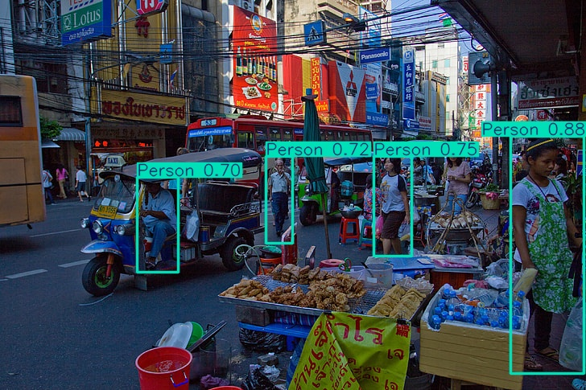

# Obstacle detection using YOLOv8 (medium)

## Overview 
This project uses transfer learning using **YOLOv8m** pretrained model to detect/track 25 distinct outdoor road obstacles  
e.g: Person, Car, Bike, tree etc...

### Dataset
* **Source:** [Kaggle Obstacle Detection Dataset](https://www.kaggle.com/datasets/abtinzandi/obstacle-detection-dataset) 🔗

  


### Evaluation Metrics
* **Validation Set:** `mAP50` = **92.40%** | `mAP50-95` = **76.01%**
* **Blind Test Set:** `mAP50` = **92.01%** | `mAP50-95` = **76.90%**

## Tech Stacks
Python  
PyTorch (CUDA Accelerated)  
OpenCV  
YOLOv8 (Ultralytics)

### Model Weights Distribution Note
> ⚠️ **File Size Management:** Due size constraints only the final optimized checkpoint weight file (`best.pt`) has been retained directly inside the `weights/` directory of this repository. Supplementary validation and intermediate weights (`last.pt`) are omitted via `.gitignore`.

## Installation
Clone the repository:

```bash
git clone https://github.com/vaebhav10/Obstacle_detection.git
cd Obstacle_detection
```

**Install dependencies:**
```bash
pip install -r requirements.txt
```

**Execute Live Tracking**
```bash
python live.py 
```
The `live.py` serves as the main deployment application for this pipeline. It captures camera video, passes them down to the CUDA-accelerated model, and outputs a live visual track with drawn class bounding boxes.

Press `q` to terminate the live tracking window

